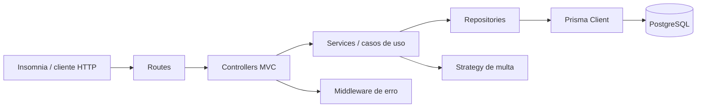

# Arquitetura

## Decisao

Foi adotada a **Arquitetura em Camadas + MVC (Opcao A)**. A API publica permanece a mesma para clientes Insomnia, Prisma Client e PostgreSQL; a mudanca fica na organizacao interna.

## Diagrama

## Responsabilidades

- `routes`: declara endpoints, middlewares de validacao e controladores.
- `controllers`: traduz parametros, corpo e resposta HTTP. Nao conhece Prisma e nao contem regra de negocio.
- `services`: orquestra casos de uso e recebe suas dependencias por injecao. Nao recebe `req` ou `res`.
- `repositories`: unica camada que importa `@prisma/client`; encapsula consultas, filtros, transacoes e persistencia.
- `domain`: regras puras que podem variar, como o calculo de multa.
- `middlewares`: validacao de entrada e tratamento padronizado de erros.
- `config/container.js`: composition root; monta repositorios, services e strategies.

## Fluxo de uma requisicao

1. O cliente envia `POST /api/v1/emprestimos` pelo Insomnia.
2. A rota executa `validarEmprestimo` e chama o controlador.
3. O controlador extrai os dados HTTP e chama `emprestimoService.registrar`.
4. O service delega a operacao ao contrato do repositorio injetado.
5. O adapter Prisma executa a transacao: valida estudante/livro, decrementa disponibilidade e cria o emprestimo.
6. O resultado retorna pelo service ao controller, que responde `201` em JSON.
7. Falhas passam pelo `erro.middleware`, que traduz erros de dominio, integridade e banco para o contrato HTTP existente.

## Padroes aplicados

### Repository (obrigatorio)

Resolve o acoplamento dos casos de uso ao Prisma. Sem ele, services e controllers dependeriam de nomes de modelos, filtros e transacoes do ORM, dificultando testes e uma futura troca de persistencia.

### Injecao de Dependencia (obrigatorio)

`EmprestimoService` e `CrudService` recebem repositorios no construtor; o `container` monta as implementacoes. Sem DI, cada service criaria sua propria conexao ou repositorio, tornando o teste sem banco e a substituicao de adapter mais dificil.

### Strategy

`MultaStrategy` encapsula o calculo variavel de multa e aceita configuracao de valor diario. Sem Strategy, regras de multa ficariam condicionais dentro do service e qualquer nova politica aumentaria o acoplamento do caso de uso.

## Troca de adapter

`EmprestimoService` depende apenas dos metodos do repositorio. Em producao, o container usa `src/repositories/emprestimo.repository.js` com Prisma. Nos testes, `EmprestimoEmMemoriaRepository` substitui o adapter sem alterar o service nem a regra de dominio. Os cinco testes unitarios demonstram essa troca sem PostgreSQL.

## Qualidade e compatibilidade

- O contrato de rotas e respostas do Trabalho 2 foi preservado.
- O OpenAPI continua em `src/docs/openapi.yaml`.
- Nenhum controller importa repositorio ou Prisma.
- O Prisma permanece restrito a `src/repositories` e `src/data/prisma.js`.
- O comportamento de transacao de criar/devolver emprestimo continua no adapter Prisma.
